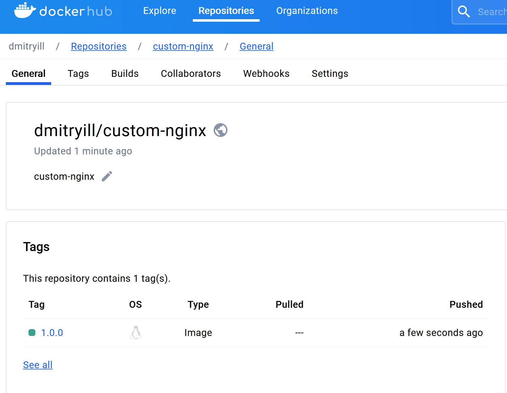
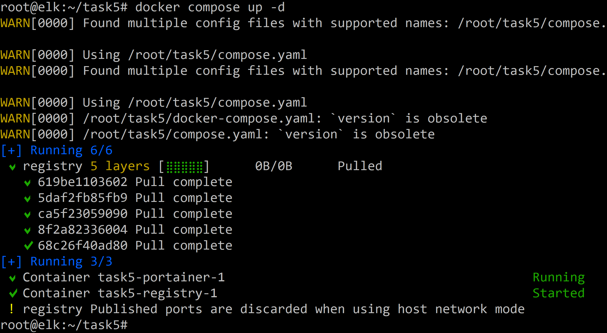
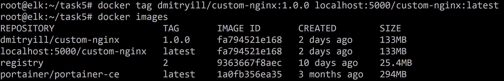
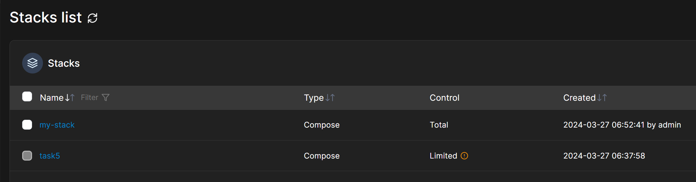
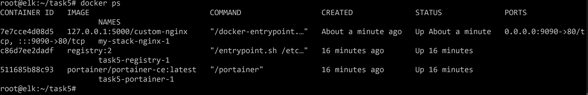

# Домашнее задание к занятию 4 «Оркестрация группой Docker контейнеров на примере Docker Compose» - Илларионов Дмитрий

## Задача 1

Сценарий выполнения задачи:
- Установите docker и docker compose plugin на свою linux рабочую станцию или ВМ.

Установил через terraform. Возможно есть мнение что код "не идеален", и плохочитаемый, но, мне сейчас удобно использовать ране созданный код, т.к. тут задание пока не по терраформу а по докеру.

- Зарегистрируйтесь и создайте публичный репозиторий  с именем "custom-nginx" на https://hub.docker.com;

https://hub.docker.com/repository/docker/dmitryill/custom-nginx/

- скачайте образ nginx:1.21.1;


- Создайте Dockerfile и реализуйте в нем замену дефолтной индекс-страницы(/usr/share/nginx/html/index.html), на файл index.html с содержимым:
```
<html>
<head>
Hey, Netology
</head>
<body>
<h1>I will be DevOps Engineer!</h1>
</body>
</html>
```

Создал dockerfile:

```
FROM nginx:1.21.1
COPY index.html /usr/share/nginx/html/index.html
```
entrypoint или CMD не стал указывать, в надежде, что они подтянутся из родительского имаджа (оказалось так и работает).

- Соберите и отправьте созданный образ в свой dockerhub-репозитории c tag 1.0.0 . 

собрал имадж:

```
docker build -t mynginx .
```
и вариант с:

```
docker build -t mynginx:1.0.0 .
```
создал токен в репозитории:


залогинился с ВМ в докер хаб:

```
docker login -u dmitryill
```


Но, видимо я не с правильным именем собрал образ, т.к. запушить не получается:


Тут нашел как надо:
https://digitology.tech/docs/docker/docker-hub/index.html

Нужно видимо было так называть образ.
Еще раз пробую:
```
docker build -t dmitryill/custom-nginx:1.0.0 .
```


Запушил:

```
docker push dmitryill/custom-nginx:1.0.0
```





- Предоставьте ответ в виде ссылки на https://hub.docker.com/<username_repo>/custom-nginx/general .

Результат:

https://hub.docker.com/repository/docker/dmitryill/custom-nginx/general


И пробовал запустить контейнер:


и проверил в браузере:


Все работает.

## Задача 2
1. Запустите ваш образ custom-nginx:1.0.0 командой docker run в соответвии с требованиями:
- имя контейнера "ФИО-custom-nginx-t2"
- контейнер работает в фоне
- контейнер опубликован на порту хост системы 127.0.0.1:8080

Запустил:

```
docker run -d -p 8080:80 --name illarionov-custom-nginx-t2 dmitryill/custom-nginx:1.0.0
```


2. Переименуйте контейнер в "custom-nginx-t2"

```
docker rename illarionov-custom-nginx-t2 custom-nginx-t2
```


3. Выполните команду ```date +"%d-%m-%Y %T.%N %Z" ; sleep 0.150 ; docker ps ; ss -tlpn | grep 127.0.0.1:8080  ; docker logs custom-nginx-t2 -n1 ; docker exec -it custom-nginx-t2 base64 /usr/share/nginx/html/index.html```

все работает только кажется тут:
```
ss -tlpn | grep 127.0.0.1:8080
```
ожидалось что-то другое, т.к. у меня это выводит пустоту:


при этом в
```
ss -tlpn 
```
- вроде бы все ок:


А так результат:
```
date +"%d-%m-%Y %T.%N %Z" ; sleep 0.150 ; docker ps ; ss -tlpn | grep 127.0.0.1:8080  ; docker logs custom-nginx-t2 -n1 ; docker exec -it custom-nginx-t2 base64 /usr/share/nginx/html/index.html
```


4. Убедитесь с помощью curl или веб браузера, что индекс-страница доступна.

уже убеждался, еще раз:


В качестве ответа приложите скриншоты консоли, где видно все введенные команды и их вывод.


## Задача 3
1. Воспользуйтесь docker help или google, чтобы узнать как подключиться к стандартному потоку ввода/вывода/ошибок контейнера "custom-nginx-t2".
2. Подключитесь к контейнеру и нажмите комбинацию Ctrl-C.

Выполнил:
```
docker attach custom-nginx-t2
```


3. Выполните ```docker ps -a``` и объясните своими словами почему контейнер остановился.


контейнер завершил свою работу, т.к. на вход контейнера был послан сигнал cntl-c =  "signal 2 (SIGINT)" .
Контейнер отработал сигнал (т.е. он может отрабатывать этот сигнал в его коде) и завершил работу и вывел в лог причину.

4. Перезапустите контейнер

```
docker start custom-nginx-t2
```


5. Зайдите в интерактивный терминал контейнера "custom-nginx-t2" с оболочкой bash.

```
docker exec -it custom-nginx-t2 bash
```


6. Установите любимый текстовый редактор(vim, nano итд) с помощью apt-get.

```
root@13d05b080bc3:/# apt-get update
root@13d05b080bc3:/# apt-get install nano
...
The following NEW packages will be installed:
  nano
0 upgraded, 1 newly installed, 0 to remove and 46 not upgraded.
Need to get 544 kB of archives.
...
```


7. Отредактируйте файл "/etc/nginx/conf.d/default.conf", заменив порт "listen 80" на "listen 81".

сделал.

8. Запомните(!) и выполните команду ```nginx -s reload```, а затем внутри контейнера ```curl http://127.0.0.1:80 ; curl http://127.0.0.1:81```.
сделал:


9. Выйдите из контейнера, набрав в консоли  ```exit``` или Ctrl-D.
10. Проверьте вывод команд: ```ss -tlpn | grep 127.0.0.1:8080``` , ```docker port custom-nginx-t2```, ```curl http://127.0.0.1:8080```. Кратко объясните суть возникшей проблемы.


Внутри контейнера мы перенастроили NGINX слушать не порт 80 а слушать теперь порт 81. А в настройках докер осталось что докер пересылает со внешнего порта 8080 на порт контейнера 80 - а там никто не слушает этот порт. Поэтому нет ответа.


11. * Это дополнительное, необязательное задание. Попробуйте самостоятельно исправить конфигурацию контейнера, используя доступные источники в интернете. Не изменяйте конфигурацию nginx и не удаляйте контейнер. Останавливать контейнер можно. [пример источника](https://www.baeldung.com/linux/assign-port-docker-container)

В целом понятно - не стал пока тратить время, но, понравился вариант с остановкой контейнера и правкой докер конфиг файла - добавления порта и опять старт контейнера.


12. Удалите запущенный контейнер "custom-nginx-t2", не останавливая его.(воспользуйтесь --help или google)

```
docker kill custom-nginx-t2
```


В качестве ответа приложите скриншоты консоли, где видно все введенные команды и их вывод.

## Задача 4


- Запустите первый контейнер из образа ***centos*** c любым тегом в фоновом режиме, подключив папку  текущий рабочий каталог ```$(pwd)``` на хостовой машине в ```/data``` контейнера, используя ключ -v.
```
docker run -d -v /root:/data centos
```


Но, при этом контейнер остановился хотя и скачася образ:


Пробовал запустить еще раз - не помогает, и в логах пусто:


Как я понял контейнер завершает свою работу, т.к. ничего не нужно больше делать, т.е. этот образ начальный, и не хватает ентрипоинта.

пробовал и так:


Но, все равно контейнер останавливается. 
Еще попробовал так:


в итоге нашел решение:
https://utyatnishna.ru/info/53378/docker-container-will-automatically-stop-after-docker-run-d

Запустил так:

```
docker run -d -v /mydir:/data centos tail -f /dev/null
```

- Запустите второй контейнер из образа ***debian*** в фоновом режиме, подключив текущий рабочий каталог ```$(pwd)``` в ```/data``` контейнера. 

аналогично - контейнер завершает свою работу:


Запустил так:

```
docker run -d -v /mydir:/data debian tail -f /dev/null
```


- Подключитесь к первому контейнеру с помощью ```docker exec``` и создайте текстовый файл любого содержания в ```/data```.


- Добавьте ещё один файл в текущий каталог ```$(pwd)``` на хостовой машине.


в первом контейнере:


- Подключитесь во второй контейнер и отобразите листинг и содержание файлов в ```/data``` контейнера.


В качестве ответа приложите скриншоты консоли, где видно все введенные команды и их вывод.


## Задача 5

1. Создайте отдельную директорию(например /tmp/netology/docker/task5) и 2 файла внутри него.
"compose.yaml" с содержимым:
```
version: "3"
services:
  portainer:
    image: portainer/portainer-ce:latest
    network_mode: host
    ports:
      - "9000:9000"
    volumes:
      - /var/run/docker.sock:/var/run/docker.sock
```
"docker-compose.yaml" с содержимым:
```
version: "3"
services:
  registry:
    image: registry:2
    network_mode: host
    ports:
    - "5000:5000"
```


И выполните команду "docker compose up -d". Какой из файлов был запущен и почему? (подсказка: https://docs.docker.com/compose/compose-application-model/#the-compose-file )


отработал только файл compose.yaml . Причина - потому что это имя файла докер обрабатывает в приоритете - by designe.

2. Отредактируйте файл compose.yaml так, чтобы были запущенны оба файла. (подсказка: https://docs.docker.com/compose/compose-file/14-include/)

Добавил:





3. Выполните в консоли вашей хостовой ОС необходимые команды чтобы залить образ custom-nginx как custom-nginx:latest в запущенное вами, локальное registry. Дополнительная документация: https://distribution.github.io/distribution/about/deploying/

Скачал свой образ из докер хаба:

```
docker pull dmitryill/custom-nginx:1.0.0
```


```
docker tag dmitryill/custom-nginx:1.0.0 localhost:5000/latest
```



```
docker push localhost:5000/latest
```


Удалил из локального репозитория:


4. Откройте страницу "https://127.0.0.1:9000" и произведите начальную настройку portainer.(логин и пароль адмнистратора)


5. Откройте страницу "http://127.0.0.1:9000/#!/home", выберите ваше local  окружение. Перейдите на вкладку "stacks" и в "web editor" задеплойте следующий компоуз:

```
version: '3'

services:
  nginx:
    image: 127.0.0.1:5000/custom-nginx
    ports:
      - "9090:80"
```

Тут возникла ошибка:



Тут я не понял. В чем ошибка?
Но, я докер контенеры поднимал на ВМ в облаке, поэтому заходил черзе внешний IP через браузер.
И я сомневаюсь корректно ли получилось залить свой образ в локальный репозиторий.

Я пробовал его залить еще раз - не получилось:



Что что-то я сделал не так при залитии образа в репозиторий?

Далее пока не делал.

.....

6. Перейдите на страницу "http://127.0.0.1:9000/#!/2/docker/containers", выберите контейнер с nginx и нажмите на кнопку "inspect". В представлении <> Tree разверните поле "Config" и сделайте скриншот от поля "AppArmorProfile" до "Driver".

7. Удалите любой из манифестов компоуза(например compose.yaml).  Выполните команду "docker compose up -d". Прочитайте warning, объясните суть предупреждения и выполните предложенное действие. Погасите compose-проект ОДНОЙ(обязательно!!) командой.

В качестве ответа приложите скриншоты консоли, где видно все введенные команды и их вывод, файл compose.yaml , скриншот portainer c задеплоенным компоузом.

---

### Правила приема

Домашнее задание выполните в файле readme.md в GitHub-репозитории. В личном кабинете отправьте на проверку ссылку на .md-файл в вашем репозитории.


